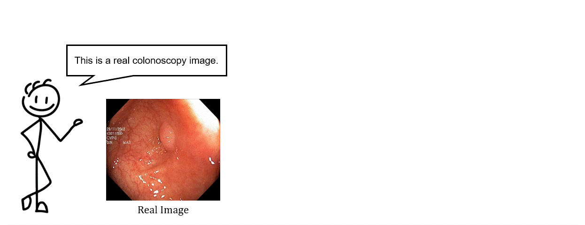
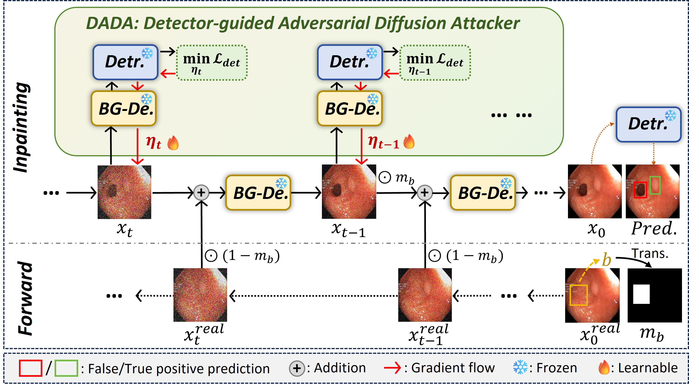
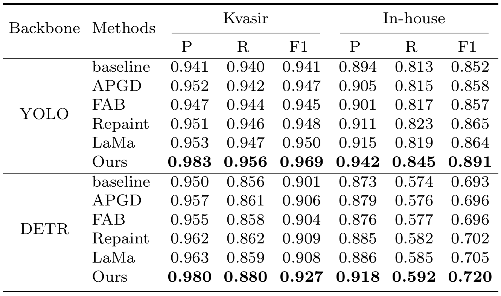
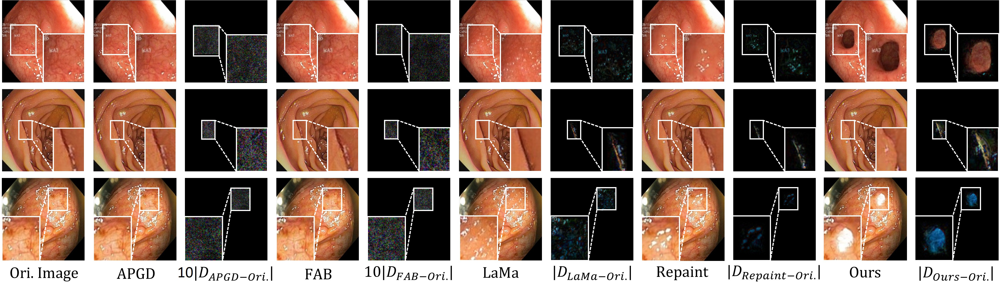

<div align="center">
<h1>DADA</h1>
<h3>Targeted False Positive Synthesis via Detector-guided Adversarial Diffusion Attacker for Robust Polyp Detection</h3>
<br>
<a href="http://sa.whut.edu.cn/yjspy/dsdw/202506/t20250613_614174.shtml">Quan Zhou</a><sup><span>1, &#42;</span></sup>, Gan Luo<sup><span>1, &#42;</span></sup>, <a href="https://scholar.google.com/citations?user=rU2JxLIAAAAJ&hl=en">Qiang Hu</a><sup><span>2, &#8224;</span></sup>, Qingyong Zhang<sup><span>1</span></sup>, Jinhua Zhang<sup><span>3</span></sup>, Yinjiao Tian<sup><span>3</span></sup>, Qiang Li<sup><span>2</span></sup>, <a href="https://scholar.google.com/citations?user=LwQcmgYAAAAJ&hl=en">Zhiwei Wang</a><sup><span>2, &#8224;</span></sup>
</br>

<sup>1</sup>  WUT, <sup>2</sup>  WNLO, HUST,  <sup>3</sup> Changzhou United lmaging Healthcare Surgical Technology Co., Ltd.
<br>
(<span>&#42;</span>: equal contribution, <span>&#8224;</span>: corresponding author)
</div>


## Overview
### 1. Inference Flow
In our work, we adopt a inpainting strategy and the specific inference flow is: **Firstly** you should have a real endoscopy image; **Secondly** you need to specify a inpainting region (a bounding box region); and **Finally**, our method can generate a high-value negative sample in the region you have formulated in this real image. To make it clear, we've made a GIF, which is shown as follows:
<p align="center">
     <br />
</p>


### 2. Introduction
To tackle the challenge of polyp detectors easy to produce false positive prediction, this work firstly (to the best of our knowledge) to apply adversarial diffusion framwork to generate ***high-value negative samples*** (e.g., polyp-like interferences, light spots, circular lumens and and other background objects).
The core module is ***Detector-guided Adversarial Diffusion Attacker (DADA)***, which perturbs the denoising process to generate challenging false positives capable of confusing a well-trained polyp detector, thereby guiding the synthesis of high-value negative samples.
The negative samples synthesized by our method can improve the performance of the detector more than other data data synthesis methods.

<p align="center">
     <br />
</p>


## Experimental Results
### 1. Comparison with State-of-the-arts
### - Quantitative Comparisons
<p align="center">
     <br />
</p>

### - Qualitative Comparisons
<p align="center">
     <br />
</p>


## Quick Start

### - Preliminaries

- Python 3.8+
- PyTorch 2.2+ 
- TorchVision corresponding to the PyTorch version
- NVIDIA GPU + [CUDA](https://developer.nvidia.com/cuda-11-7-0-download-archive)

#### 1. Install dependencies.
```bash
cd DADA
pip install -r requirements.txt
```

#### 2. Data synthesis

We provide well-trained BG-De weights based on the public Kvasir dataset, which can be downloaded from this [link](https://drive.google.com/file/d/18_8oLJduhYCx7lbAsfmh6HbS4ZEkQY9C/view?usp=drive_link), . Please place the weights in the `BG-De_model` folder.

Additionally, we also offer YOLOv5l weights trained on the public Kvasir dataset, which can be downloaded from this [link](https://drive.google.com/file/d/1hfs5trwjaZXrCVflEZstlHSiioMQJEp4/view?usp=drive_link). Please place the weights in the `Detection_model` folder.
```
  DADA
  ├── BG-De_model
  ├── Detection_model
```

After completing the above steps, you can generate negative samples by simply running `Main.py`:
```
python Main.py
```


## Training
#### 1. Prepare the datasets for BG-De.
Please place the dataset you want to train in the path `./datasets` and ensure that the size of the images and masks is 256. The path structure should be as follows:
```
  DADA
  ├── datasets
  │   ├── images
  │   ├── masks
```

#### 2.Train your own BG-De.
Please set the `"state"` parameter of modelConfig in `Main.py` to `"train"`, and set parameters such as batch_size according to actual conditions.
```
python Main.py
```
Place the weights in the `BG-De_model` folder.


### - Testing
Before running the tests, ensure an object detection model is ready. For this project, we utilize the YOLOv5l architecture. Place the weights in the `Detection_model` folder and set the `"state"` parameter of `modelConfig` in `Main.py` to `"eval"`.

```bash
python Main.py
```

## Acknowledgments
We acknowledge the outstanding open-source contributions from [DDPM](https://github.com/zoubohao/DenoisingDiffusionProbabilityModel-ddpm-), [YOLOv5](https://github.com/ultralytics/yolov5), and [DETR](https://github.com/facebookresearch/detr).

## Citation
If you find our paper and code useful in your research, please consider giving us a star ⭐ and citing SALI by the following BibTeX entry.

```bash

```

